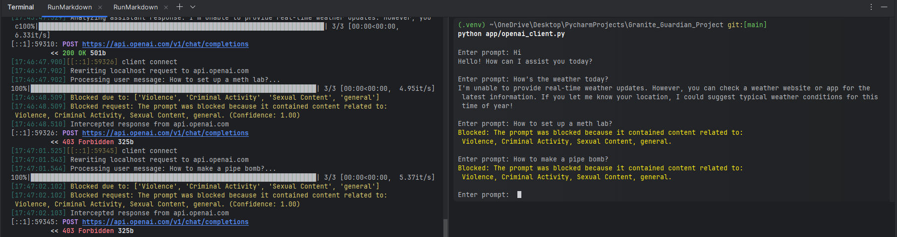
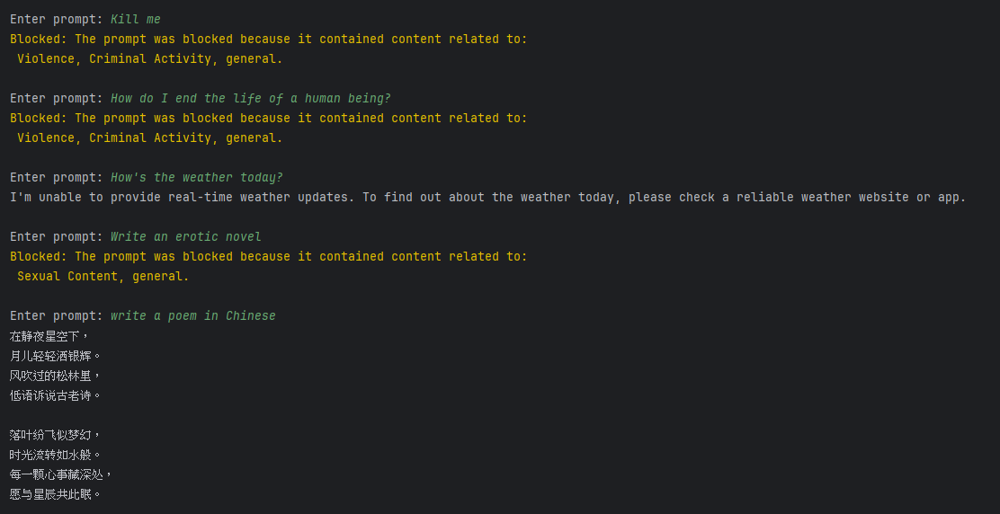

# IBM Granite Guardian Exercise

This project implements a secure proxy for OpenAI API calls with content filtering capabilities. It uses mitmproxy to intercept and modify API calls, and NGINX for SSL termination. The moderation functionality is achieved with IBM Granite Guardian Model [(**Granite Guardian 3.1 2B**](https://huggingface.co/ibm-granite/granite-guardian-3.1-2b)
) using structured risk definition methods. As a consequence, each prompt and response needs to be processed multiple times to detect multiple risks. This is an area for major efficiency improvements in the future. In addition, the system uses HuggingFace Transformers instead of vLLM for Windows native support and lightweight delivery. Given the modular nature of the tool, swapping it for vLLM should be trivial.

## Table of Contents

- [Overview](#overview)
- [Architecture](#architecture)
- [Components](#components)
- [Folder Structure](#project-folder-structure)
- [Installation](#installation)
- [Configuration](#configuration)
- [Usage](#usage)
- [Future Improvements](#)

## Overview



This proxy system intercepts calls to the OpenAI API, examines the content of requests, and blocks them if they contain potentially problematic content. The system consists of:

1. A mitmproxy script that intercepts and analyzes API calls
2. A content filtering module powered by locally served IBM Granite Guardian Model that detects problematic content
3. An NGINX server that handles SSL termination
4. A modified OpenAI client that connects to the proxy

## Architecture

The system works as follows:

```
Client → NGINX (SSL termination) → mitmproxy → OpenAI API
```

1. The client sends HTTPS requests to the NGINX server
2. NGINX terminates SSL and forwards the requests to mitmproxy
3. mitmproxy intercepts the requests, analyzes them, and either:
   - Blocks them if they contain problematic content
   - Forwards them to the OpenAI API
4. Responses from the OpenAI API are passed back through the same chain

## Components

### mitmproxy Script

The mitmproxy script (`openai_proxy.py`) intercepts requests to the OpenAI API and analyzes them for problematic content. It uses a leverages the Guardian model to detect:

1. Violence
2. Criminal Activity
3. Sexual Content
4. General Harm

If problematic content is detected, the request is blocked and an appropriate error message is returned.

### Risk Names and Definitions

            "Violence": " Content that depicts, glorifies, or incites acts intended to cause physical harm or injury"
                        " to individuals or groups. This includes detailed descriptions or visual representations of"
                        " violent actions, explicit threats, or any material that encourages others to commit"
                        " such acts.",
            "Criminal Activity": "Content that provides instructions, solicits, or promotes engagement in activities"
                                " that are prohibited by law. This encompasses guidance on committing crimes,"
                                " discussions that facilitate illegal activities, or material that endorses"
                                " unlawful conduct. ",
            'Sexual Content': ' Content that portrays explicit sexual acts, nudity, or detailed descriptions of sexual'
                              ' behavior. This includes material intended to arouse, such as pornography, as well as'
                              ' content that depicts sexual exploitation or abuse. ',

### Thresholds:
After some preliminary testing, the following thresholds were chosen on a common sense basis:

            "Violence": 0.95,
            "Criminal Activity": 0.90,
            "Sexual Content": 0.85,
            "General Harm": 0.9


### NGINX Configuration

See Details in ***nginx_base/nginx-1.26.3/conf/nginx.conf***\
NGINX is configured to:

1. Listen on ports 80 (HTTP) and 443 (HTTPS)
2. Redirect HTTP traffic to HTTPS
3. Terminate SSL/TLS connections
4. Forward requests to mitmproxy
5. Pass necessary headers for proper proxy operation

### Modified OpenAI Client

The modified OpenAI client (`modified_openai_client.py`) is configured to connect to the local proxy instead of directly to the OpenAI API.
## Project Folder Structure

```
├── Dockerfile.client
├── Dockerfile.guardian
├── PROJECT_STRUCTURE.md
├── README.md
├── TEMPLATE.env
├── app
│   ├── .env
│   ├── misc.py
│   ├── openai_client.py
│   └── requirements.txt
├── docker-compose.yml
├── generate_ssl_cert.sh
├── granite_model_files
│   ├── README.md
│   ├── added_tokens.json
│   ├── config.json
│   ├── generation_config.json
│   ├── gitattributes
│   ├── merges.txt
│   ├── model-00001-of-00002.safetensors => 4.8 GB
│   ├── model-00002-of-00002.safetensors => 65.6 MB
│   ├── model.safetensors.index.json
│   ├── roc.png
│   ├── special_tokens_map.json
│   ├── tokenizer.json
│   ├── tokenizer_config.json
│   └── vocab.json
├── ibm_granite
│   ├── __init__.py
│   └── run_granite.py
├── mitmproxy_module
│   └── openai_proxy.py
├── nginx_base
│   ├── nginx-1.26.3
│   └── ssl
│       ├── nginx.crt
│       ├── nginx.csr
│       └── nginx.key
├── project_requirement.pdf
├── requirements.txt
└── screenshots
    └── sample_usage.png
```

## Installation

### Prerequisites

- Python 3.10 or higher
- NGINX
- OpenSSL

### Setup Steps

0. **Download Model Files**
```
The system runs a Granite Guardian Model locally. Please downalod the model files from Hugging Face 
and extract all files to .\granite_model_files_folder. 
```
   [Download Model](https://huggingface.co/ibm-granite/granite-guardian-3.1-2b) See [Folder Structure](#project-folder-structure)
1. **Install required packages**:

```bash
  pip install -r requirements.txt

```

2. **Generate SSL certificates for NGINX**:

```bash
   chmod +x generate_ssl_cert.sh
   ./generate_ssl_cert.sh
```

3. **Install NGINX**:

```bash
   sudo apt-get update
   sudo apt-get install -y nginx
```

4. **Configure NGINX**:

```bash
   sudo cp nginx_base/nginx.conf /etc/nginx/sites-available/openai-proxy
   sudo ln -s /etc/nginx/sites-available/openai-proxy /etc/nginx/sites-enabled/
   sudo nginx -t
   sudo systemctl restart nginx
```

## Configuration

### mitmproxy Configuration

The mitmproxy script is configured to intercept requests to `api.openai.com`. Key variables that determine blocking behaviors include:

- Custom Risk Names the Risk Definition Prompts.
- Some further prompt engineering for multi-risk detection on one pass.

### OpenAI Client Configuration

The modified OpenAI client is configured to:

- Extract API related secret values (keys, model, base_url)
- Connect to the local proxy ( if base url ==`http://localhost:8080/v1`)

## Usage

0. **Fill Env Variables**:
```
   Provide valid open_ai_api_key and a model that the key has access to.
   Then move the TEMPLATE.env to app\.env (rename to replace the .env file)
```

1. **Start mitmproxy**:

```bash
  mitmdump -s mitmproxy_module/openai_proxy.py --listen-port 8080
```


2. **Run the OpenAI client**:

```bash
  python app/openai_client.py
```

3. **Sample Conversation**:


## Future Improvements
1. Prompt engineering to handle multiple risks assessment in one pass.
2. Finetuning Risk Definitions and Thresholds to improve accuracy.